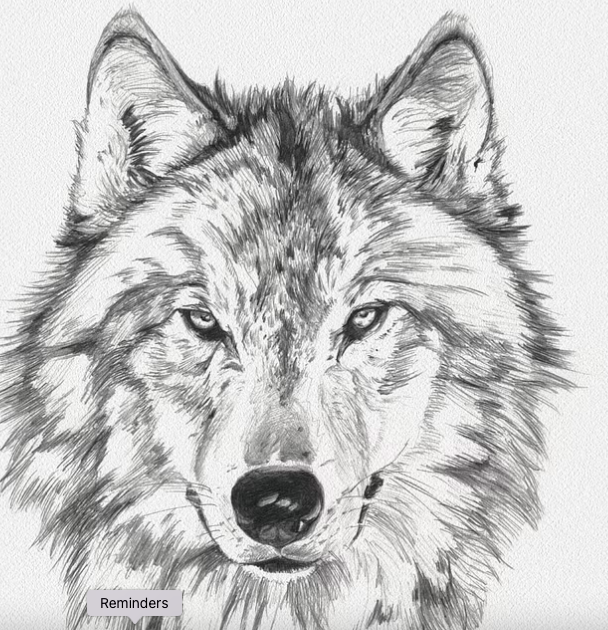

# 🧬  canis_lupus2.0
# CanisLupus2.0: Microbiome Analysis Dashboard
---

## 📌 Table of Contents
- [Project Overview](#Project_Overview)
- [Features](#features)
- [How to Use](#How_to_Use)
- [ Key Analyses](#Key_Analyses)
- [License](#License)
- [Contact](#Contact)

---

**A **Shiny-based interactive dashboard** for visualizing and analyzing microbiome data.**
**Built with **R, Shiny, phyloseq, and Docker** for reproducibility and ease of use.**

CanisLupus2.0 is a user-friendly, web-based tool designed for researchers and bioinformaticians to explore, analyze, and visualize microbiome datasets. Built with R, Shiny, and phyloseq, this app allows users to upload their own data (ASV tables, taxonomy, metadata, and phylogenetic trees) and perform comprehensive analyses.

## 🧪 Project Overview
- **Author**: Philip Yamoah Appiah
- **Afilliated Institution**: Student  at George Washington University – MS Health Data Science
- **Tools**: R Shinny, 
---
## **Features**
✅ **Open the app in R**: Run the app.R file in R and the Shinny app will open in a browser.
✅ **Data Upload**: Upload ASV, taxonomy, metadata, and phylogenetic tree files.
You can find sample data here in the![skin_data] folder.
✅ **Visual Exploration**: Interactive bar plots, pie charts, rarefaction curves, and phylogenetic trees.

✅ **Community Analysis**: Alpha/beta diversity, core microbiome, and correlation networks.

✅ **User-Friendly UI**: Intuitive interface with themed styling.

✅ **Docker Support**: Pre-configured Docker image for easy deployment.

---
## 🧪  How to Use

1. Run `app.R` in R.
2. Upload ASV, taxonomy, metadata, and phylogenetic tree files. You can find sample dataset here in the![skin_data] folder.
3. Click on the Load bottom and wait for the summary statistics.
4. Explore the Visual Exploration, Community Profile and Network Analysis with different taxanomic level and features.

## 🧪 Key Analyses

- ✅ Taxonomic profiling at phylum/genus levels
- ✅ Alpha diversity (Shannon, Simpson indices)  
- ✅ Beta diversity (Bray-Curtis distance, PCoA plots)  
- ✅ Visualization of taxa abundance (bar plots, heatmaps)  
- ✅ Sample clustering and dendrograms  

## 💻 Technologies Used
- `R shinny`
- `Bioconductor-Physoseq`

## Install and load these libraries your R environment:
Load the required libraries
library(shiny)
library(phyloseq)
library(plotly)
library(DT)
library(vegan)
library(ape)
library(ggtree)
library(ggplot2)
library(tidyverse)
library(metacoder)
library(networkD3)
library(heatmaply)
library(patchwork)

## 🔒 License

This project is for academic demonstration and analysis purposes.

## ✉️ Contact

For questions or collaboration, please contact:  
**Philip Yamoah Appiah**  
📧 [pyappiah561@gmail.com  

---

